<div align="center">

```text
  ____                  _                 
 / ___|  __ _ _ __  ___| |__   __ _ _ __  
 \___ \ / _` | '_ \|_  / '_ \ / _` | '__| 
  ___) | (_| | | | |/ /| | | | (_| | |    
 |____/ \__,_|_| |_/___|_| |_|\__,_|_|    
                                          
  ___ _ _      _     _          _             
 |_ _| (_) ___| |__ | |__   ___| | _______   __
  | || | |/ __| '_ \| '_ \ / _ \ |/ / _ \ \ / /
  | || | | (__| | | | |_) |  __/   < (_) \ V / 
 |___|_|_|\___|_| |_|_.__/ \___|_|\_\___/ \_/  
```



<br/>

[](https://sanzhar-ilichbekov-portfolio.vercel.app/)
[](https://www.linkedin.com/in/sanzhar-ilichbekov-64340025b)
[](https://github.com/Sancar22-debug)
[](mailto:sancarilichbekov@gmail.com)

</div>

---

### `> whoami`

I am a Software Engineering student from Kyrgyzstan focused on building useful, practical, and modern software.

I work with full stack development, AI, computer vision, automation, and game development. I like creating projects that connect technology with real-world problems, especially in security systems, business websites, image analysis, intelligent applications, and scalable backend systems.

---

### `> ls /usr/local/skills`

**[ Languages ]**


**[ Frontend ]**


**[ Backend ]**


**[ Databases, Cloud & Infrastructure ]**


**[ AI & Computer Vision ]**


**[ Game Development & Tools ]**


---

### `> cat ~/projects.txt`

```text
AI & Computer Vision           Full Stack Development
--------------------           ----------------------
[*] Object detection           [*] Modern landing pages
[*] Image analysis             [*] Business websites
[*] Deep learning              [*] SaaS-style platforms
[*] ML models                  [*] Backend APIs
[*] Real-time tracking         [*] Database-connected apps
[*] Security systems           [*] Clean/responsive UI

Backend & Systems              Games & Interactive
-----------------              -------------------
[*] FastAPI and Flask APIs     [*] Unity 2D games
[*] Django web apps            [*] Roblox Studio projects
[*] Postgres & Supabase        [*] AI-game integrations
[*] Redis caching              [*] Python-to-game CV
[*] Apache Kafka               [*] Interactive learning
[*] Cloud deployment
```

---

### `> ./run_showcase.sh --type=selected`

<div align="center">

| | | |
|:---:|:---:|:---:|
| <a href="https://github.com/Sancar22-debug/Roblox_CV-School-Project"></a><br/><b>Roblox Object Detection</b><br/><sub>Computer vision integration inside Roblox using Python and YOLO.</sub> | <a href="https://github.com/Sancar22-debug/Bazar.AI"></a><br/><b>Bazar.AI</b><br/><sub>SaaS project for smart accounting and business support.</sub> | <a href="https://github.com/Sancar22-debug/Security_system_CV"></a><br/><b>Surveillance Intrusion Detection</b><br/><sub>Zone monitoring and person tracking using YOLOv8.</sub> |
| <a href="https://github.com/Sancar22-debug/Violence_Detection_CV"></a><br/><b>Violence Detection System</b><br/><sub>AI video classification project for safety monitoring.</sub> | <a href="https://github.com/Sancar22-debug/nasa-spaceapps-exoplanet"></a><br/><b>NASA Space Apps Project</b><br/><sub>Data and ML project related to exoplanet research.</sub> | <a href="https://github.com/Sancar22-debug/image_insight_analyzer"></a><br/><b>Image Insight Analyzer</b><br/><sub>AI-powered image analysis tool.</sub> |

</div>

---

### `> ./run_showcase.sh --type=web`

<div align="center">

| | |
|:---:|:---:|
| <a href="https://uniqumsport.kg/"></a><br/><b>Uniqum Sport</b><br/><sub>Business landing page with amoCRM integration.</sub> | <a href="https://www.delegation.kg/"></a><br/><b>Kyrgyzstan Government Delegation</b><br/><sub>Official static website with a clean professional design.</sub> |
| <a href="https://dominant.kg/"></a><br/><b>Dominant+</b><br/><sub>Official website for a leading construction company.</sub> | <a href="https://artsky.kg/"></a><br/><b>Artsky</b><br/><sub>Digital presence for an architecture and design firm.</sub> |

</div>

---

### `> ping -c 4 contact`

```text
PING contact (127.0.0.1) 56(84) bytes of data.
64 bytes from 127.0.0.1: icmp_seq=1 ttl=64 time=0.034 ms
64 bytes from 127.0.0.1: icmp_seq=2 ttl=64 time=0.035 ms
64 bytes from 127.0.0.1: icmp_seq=3 ttl=64 time=0.040 ms
64 bytes from 127.0.0.1: icmp_seq=4 ttl=64 time=0.038 ms

--- contact ping statistics ---
4 packets transmitted, 4 received, 0% packet loss, time 3060ms

--- IMPORTANT ---
I am open to collaboration, internships, freelance projects, and AI/full-stack development opportunities.
```

<div align="center">

[](https://sanzhar-ilichbekov-portfolio.vercel.app/)
[](https://www.linkedin.com/in/sanzhar-ilichbekov-64340025b)
[](https://github.com/Sancar22-debug)
[](mailto:sancarilichbekov@gmail.com)

</div>

---

### `> exit`

<div align="center">
<br/>

<br/>
<br/>
<sub>System shutting down... Thanks for visiting my profile. Building intelligent software, AI tools, and real-world digital solutions.</sub>
</div>
